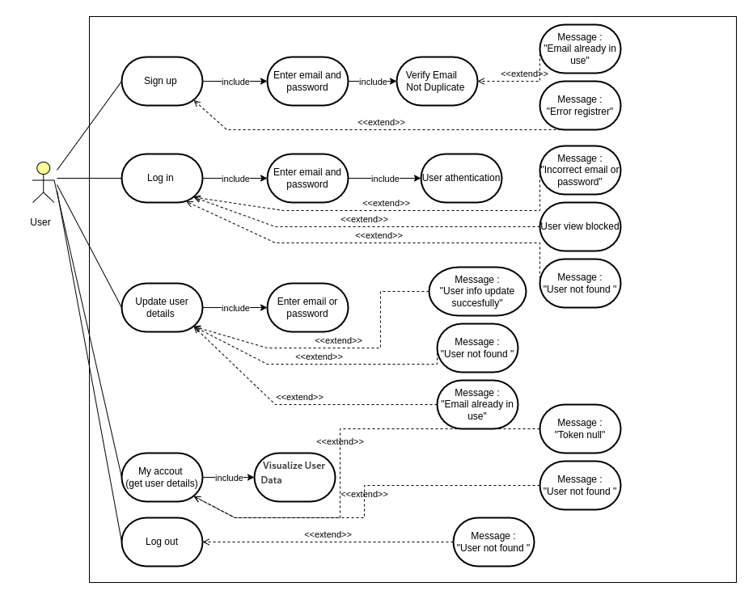
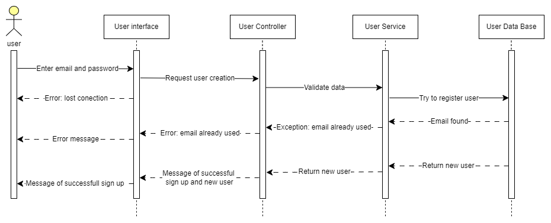
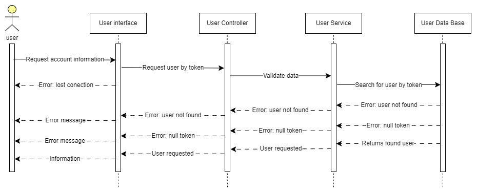
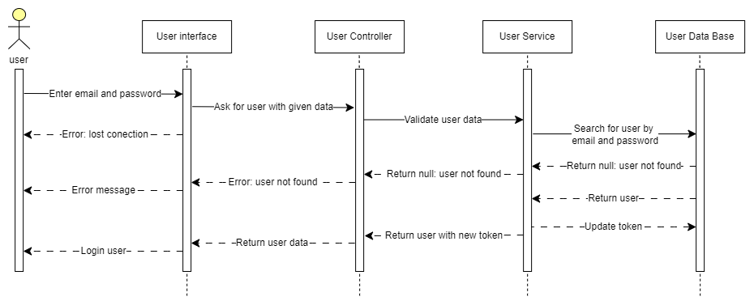
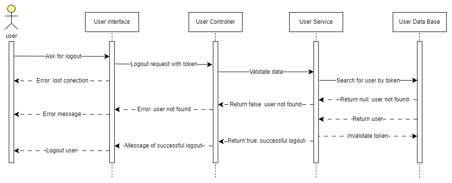
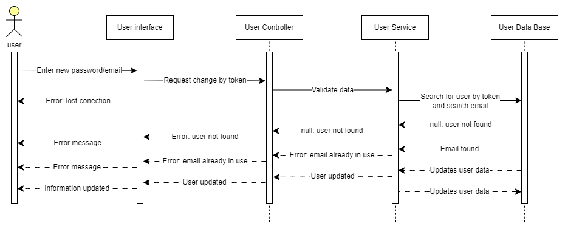
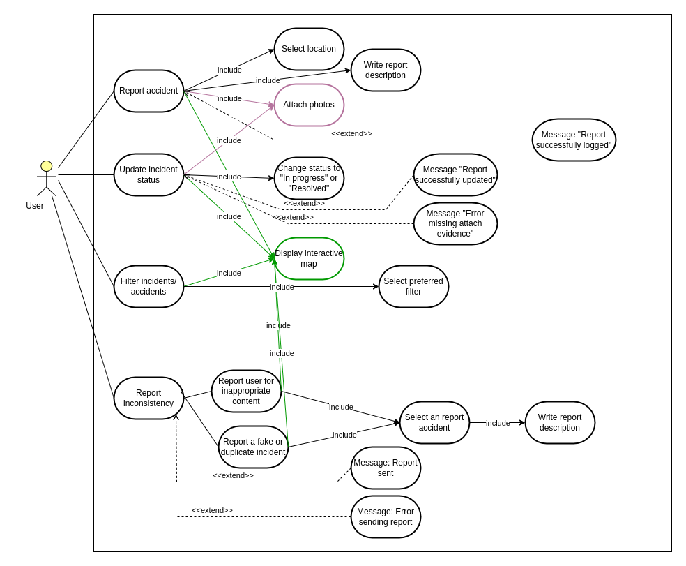

# Documentación del Sistema de Gestión de Incidentes Urbanos

## Equipo: Capibaras vs Labubus 2  

Integrantes:

- Barrientos Sánchez José Antonio
- Figueroa Barrientos Andrea Valeria
- Morales Chaparro Gael Antonio
- Ortiz Cervantes Leonardo Rafael
- Rivera Lara Sandra Valeria

## Historial de Cambios

<table style="border-collapse: collapse; width: 100%; border: 1px solid black;">
  <tr>
    <th style="border: 1px solid black; padding: 8px;">Versión</th>
    <th style="border: 1px solid black; padding: 8px;">Fecha</th>
    <th style="border: 1px solid black; padding: 8px;">Descripción</th>
    <th style="border: 1px solid black; padding: 8px;">Autor</th>
  </tr>

  <tr>
    <td style="border: 1px solid black; padding: 8px;">1.2.0 frontend</td>
    <td style="border: 1px solid black; padding: 8px;">28 de abril</td>
    <td style="border: 1px solid black; padding: 8px;">Esta iteración se centra en implementar los primeros cuatro casos de uso de un incidente.  
    Comentario: El porcentaje realizado antes del corte debido al paro es de aproximadamente un 45%, esto debido al avance en todos los casos tanto del lado del frontend como del backend, aunque hace falta terminar de pulir el manejo de envío de información entre componentes en el frontend para una buena visualización.  
    Componentes implementados: 
    - Mapa de Google Maps (componente Mapa) 
    - CreateIncidents (CU1): Subcomponentes: DescriptionBox, IncidentFilter, ImageUploader 
    - VisualizeIncident (CU4) 
    - UpdateIncident (CU2): Subcomponente: ImageUploader 
    - Navbar (CU3) para filtrado de incidentes
    </td>
    <td style="border: 1px solid black; padding: 8px;">
    Sandra Rivera
Leonardo Ortiz
Andrea Figueroa 
</td>
  </tr>

  <tr>
    <td style="border: 1px solid black; padding: 8px;">1.2.0 backend</td>
    <td style="border: 1px solid black; padding: 8px;">28 de abril</td>
    <td style="border: 1px solid black; padding: 8px;">
    Añadido de propiedades en el modelo del usuario: lista de incidencias y rol. 
    Creación del modelo de un incidente urbano. 
    Creación de endpoints PATCH, DELETE para la API de usuarios. 
    Creación de endpoints GET, POST, PATCH, DELETE para la API de incidentes. 
    Creación de excepciones personalizadas: 
    - Para usuarios: Token inválido, email inválido, usuario no encontrado. 
    - Para incidentes: Patch inválido, falta de evidencia, no ser usuario ADMIN, entre otras. 
    Documentación con Swagger para ambas APIs e implementación de ejemplos de respuesta. 
    Validación de datos recibidos usando Hibernate.
    </td>
    <td style="border: 1px solid black; padding: 8px;">Gael Chaparro
Antonio Barrientos
</td>
  </tr>

  <tr>
    <td style="border: 1px solid black; padding: 8px;">1.0.0 frontend</td>
    <td style="border: 1px solid black; padding: 8px;">25 de marzo</td>
    <td style="border: 1px solid black; padding: 8px;">Esta iteración se centró en implementar los casos de uso básicos de usuario, cubriendo el ciclo completo de autenticación y gestión de datos personales para garantizar una experiencia fluida.  
    Casos de usos implementados: 
    - CU9: Registro de Usuario (Sign Up) 
    - CU10: Obtener Información de Usuario 
    - CU11: Inicio de Sesión (Login) 
    - CU12: Cierre de Sesión (Logout) 
    </td>
    <td style="border: 1px solid black; padding: 8px;">Todos los miembros de Capibaras vs Labubu 2</td>
  </tr>

  <tr>
    <td style="border: 1px solid black; padding: 8px;">1.0.0 backend</td>
    <td style="border: 1px solid black; padding: 8px;">25 de marzo</td>
    <td style="border: 1px solid black; padding: 8px;">Esta iteración se centró en implementar la base de la API para autenticación y manejo de usuarios, incluyendo creación, obtención, inicio y cierre de sesión de usuarios.</td>
    <td style="border: 1px solid black; padding: 8px;">Todos los miembros de Capibaras vs Labubu 2</td>
  </tr>
</table>

## 1. Introducción

### 1.1 Propósito

El presente documento especifica los requerimientos funcionales y no funcionales de la **Aplicación Web para el Registro y Gestión de Incidentes Urbanos**.  
El propósito del proyecto es crear un sistema que permita a los ciudadanos registrar, visualizar y gestionar incidentes urbanos (como baches, luminarias descompuestas, obstáculos en la vía pública, entre otros). Se busca brindar una herramienta que permita una mejor gestión de problemas que aquejan a la comunidad mediante la participación de la ciudadanía y el gobierno, con el fin de mejorar la infraestructura urbana.

### 1.2 Alcance

El sistema permitirá a los usuarios reportar incidentes urbanos, marcando su ubicación en un mapa interactivo, adjuntando fotografías y proporcionando una breve descripción. Además, cualquier usuario podrá actualizar el estado de un incidente a **"En proceso"** o **"Resuelto"**. La aplicación mostrará todos los incidentes en un mapa categorizados según su tipo y estado.

### 1.3 Definiciones y Abreviaciones

- **Usuario:** Cualquier persona que utiliza la aplicación para reportar, actualizar o buscar incidentes y comentar en las publicaciones. Así mismo puede hacer reportes hacia otros usuarios.
- **Incidente:** Reporte de un problema urbano (ej.: bache, luminaria, obstáculo).
- **Administrador:** Usuario con permisos especiales.  
  - **Permisos especiales:** Permitir borrar publicaciones de incidentes y gestionar cuentas de los usuarios no administradores (poder darlas de baja).  
- **Estado:** Situación actual del incidente.  
  - **Reportado:** Fue publicado con evidencia (fotos) y hasta el momento ningún ciudadano o autoridad ha publicado un avance en la aplicación.  
  - **En proceso:** Algún usuario publicó evidencia (fotos) de que el incidente está siendo tratado.  
  - **Resuelto:** Algún usuario publicó evidencia (fotos) de que el incidente ya está completamente arreglado y no genera ningún riesgo o molestia para la ciudadanía.  

### **Tipo de Incidente**

- **Automovilístico**  
  - Accidentes de tránsito que involucren vehículos o peatones.  
  - Vehículos obstruyendo la vía tras un choque.  
  - Daños en infraestructura causados por colisiones.  
- **Infraestructura Vial**  
  - Baches, grietas o hundimientos en el pavimento.  
  - Falta o deterioro de señalización vial y semáforos averiados.  
  - Puentes, banquetas o pasos peatonales en mal estado.  
- **Medio Ambiente y Fenómenos Naturales**  
  - Árboles caídos o en riesgo de caída.  
  - Inundaciones.  
  - Fugas de agua, drenaje obstruido o contaminación en espacios públicos.  
- **Arquitectura**  
  - Daños en edificios (grietas o estructura interna en mal estado).  
  - Daños estructurales en edificaciones de transporte público.  
- **Otros (Manifestaciones, Ferias, Eventos)**  
  - Concentraciones de personas por marchas o protestas.  
  - Eventos públicos que bloqueen calles o espacios urbanos.  
  - Instalaciones temporales como ferias o mercados ambulantes.  

---

## 2. Requerimientos del Sistema

### **2.1 Requerimientos Funcionales**

- **RF1: Registro de Incidentes**  
  - Permitir a los usuarios reportar incidentes.  
  - **Ubicación:** Los usuarios deben marcar la ubicación del incidente en un mapa interactivo.  
  - **Adjuntar evidencia:** Permitir adjuntar una o más fotografías.  
  - **Descripción:** Incluir una breve descripción del problema.  

- **RF2: Actualización del Estado de Incidentes**  
  - Permitir a cualquier usuario actualizar el estado del incidente a **"En proceso"** o **"Resuelto"**.  
  - Permitir que el usuario dueño de una publicación de incidente pueda eliminarla solamente cuando esta no se encuentre en el estado de **"Reportado"**.  
  - Requerir evidencia fotográfica cuando se marque el incidente como **"En proceso"** o **"Resuelto"**.  
  - I**Descripción:** Incluir una breve descripción de la actualización del incidente.  

- **RF3: Visualización de Incidentes**  
  - Mostrar los incidentes en un mapa interactivo.  
  - Permitir filtros por tipo de incidencia, ubicación, estado y filtros personalizados.  

- **RF4: Gestión de Usuarios y Roles**  
  - Registro, creación y autenticación de usuarios.  
  - Gestión de perfiles, incluyendo la asignación de roles (Usuario y Administrador).  
  - Permitir que los usuarios puedan reportar a otros usuarios con comentarios del por qué.  
  - Permitir que los administradores puedan dar de baja publicaciones y cuentas de usuarios.  

### **2.2 Requerimientos No Funcionales**

- **RNF1: Seguridad**  
  - Cifrado de contraseñas y datos sensibles.  
  - Implementación de inicio de sesión con Google y autorización.  
  - **Uso de protocolo HTTPS** para garantizar la seguridad de la comunicación entre clientes y servidores.  
  - Uso de contraseñas seguras (mínimo de caracteres requeridos).  
  - Solo usuarios con cuenta pueden registrar incidentes.  

- **RNF2: Rendimiento**  
  - Soportar aproximadamente 100 usuarios simultáneos.  
  - Garantizar que las búsquedas y actualizaciones en el sistema se realicen en menos de 2 segundos en promedio.  

- **RNF3: Disponibilidad**  
  - Asegurar una disponibilidad del sistema del 99% o superior.  

- **RNF4: Usabilidad**  
  - Interfaz intuitiva y accesible para los usuarios.  
  - Diseño responsive para facilitar el uso en dispositivos móviles.  

---

## 3. Casos de Uso

### **CU1: Registro de un Incidente**  

**Actores:** Usuario  
**Flujo Principal:**

1. El usuario inicia sesión en la aplicación.
2. Selecciona la opción **"Reportar Incidente"**.  
3. Marca la ubicación del incidente en el mapa interactivo.  
4. Adjunta una o más fotografías.  
5. Escribe una breve descripción del problema.  
6. Envía el reporte y el sistema registra el incidente con estado **"Reportado"**.  

### **CU2: Actualización del Estado de un Incidente**

**Actores:** Usuario, Administrador  
**Flujo Principal:**  

1. El usuario o administrador inicia sesión en la aplicación.
2. Selecciona un incidente previamente reportado.  
3. Cambia el estado a **"En proceso"** o **"Resuelto"**.  
4. Se solicita adjuntar evidencia fotográfica.  
5. El sistema actualiza el estado del incidente.  

**Flujo Alternativo:**  

- Si no se adjunta la evidencia al cambiar a "Resuelto", el sistema muestra un mensaje de error y solicita la prueba correspondiente.

### **CU3: Visualización y Filtro de Incidentes**

**Actores:** Usuario, Administrador  
**Flujo Principal:**

1. El usuario accede a la página.
2. El sistema despliega un mapa interactivo con todos los incidentes registrados.
3. El usuario aplica filtros (por tipo de incidente y estado).
4. El sistema actualiza la vista con los incidentes que cumplen los criterios de búsqueda.

### **CU4: Visualización de Incidentes**

**Actores:** Usuario, Administrador  
**Flujo Principal:**

1. El usuario accede a la página.  
2. El sistema despliega un mapa interactivo con todos los incidentes registrados.  
3. El usuario selecciona sobre el mapa un ya incidente reportado.  
4. El sistema despliega una ventana con todos los datos pertinentes del incidente:  
   - Estado  
   - Fecha  
   - Usuario que lo registró  
   - Tipo de incidente  
   - Descripción  
   - Pruebas (Fotos)  
5. Una vez revisado el incidente, el usuario tendrá la opción de cerrar la ventana y seguir navegando en el mapa.

### **CU5: Reporte de Incidente Falso o Inadecuado**

**Actores:** Usuario, Administrador  
**Flujo Principal:**

1. El usuario inicia sesión y accede a un incidente.  
2. El sistema despliega el mapa interactivo.  
3. El usuario selecciona un registro de incidente.  
4. Selecciona la opción "Reportar incidente falso, inadecuado".  
5. El usuario proporciona una justificación del reporte y envía el reporte.  
6. El sistema guarda el incidente para su revisión. Y enviará una notificación de “Reporte registrado”.

**Flujo Alternativo:**

- El usuario le da cancelar/ cerrar pestaña, y no se registra el reporte.

### **CU6: Archivar Incidente Resuelto**

**Actores:** Administrador  
**Flujo Principal:**

1. El administrador inicia sesión en la aplicación.  
2. Accede a la lista de incidentes marcados como "Resuelto".  
3. Selecciona un incidente y verifica que cumple con los criterios de resolución.  
4. Elige la opción "Archivar Incidente".  
5. El sistema cambia el estado del incidente a "Archivado" y lo oculta del mapa interactivo.

**Flujo Alternativo:**

- Si el incidente no está completamente resuelto, el administrador puede revertir el estado a "En proceso".

### **CU7: Eliminar Incidente Falso o Inadecuado**

**Actores:** Administrador  
**Flujo Principal:**

1. El administrador inicia sesión y revisa los incidentes reportados como "Falso o inadecuado”.  
2. Selecciona un incidente y evalúa la justificación proporcionada.  
3. Si confirma que es inválido:  
   a) Tiene la opción de: *dar de baja al usuario*. El botón añadirá al usuario en una lista para eliminarlo después.  
   b) Elige la opción "Eliminar Incidente".  
4. El sistema solicita confirmación y, tras aceptar, elimina permanentemente el registro.  

**Flujo Alternativo:**

- Si el incidente es válido, el administrador puede marcarlo como "Confirmado".

### **CU8: Gestionar Usuarios Reportados**

**Actores:** Administrador  
**Flujo principal:**

1. El administrador inicia sesión y accede a la sección "Usuarios Reportados".  
2. El sistema muestra una lista de usuarios con reportes pendientes, incluyendo:  
   - Nombre del usuario reportado.

3. El administrador selecciona un usuario y escogerá si eliminar o no al usuario.

**Flujo Alternativo:**

- El administrador cierra la ventana de usuarios reportados y la lista no se muta.

### **CU9: Registro de Usuario**

**Actores:** Usuario (no registrado)  
**Flujo Principal:**

1. El usuario ingresa a la aplicación y selecciona "Registrarse".  
2. El sistema muestra un formulario con campos:  
   - Correo electrónico.  
   - Contraseña.  
3. El usuario introduce sus datos y envía el formulario.  
4. El sistema valida que:  
   - El correo no esté registrado previamente.  
5. Si todo es correcto, el sistema:  
   a) Crea un nuevo usuario en la base de datos.  
   b) Muestra mensaje: "Registro exitoso. ¡Bienvenido/a!".

**Flujos Alternativos:**

- **FA1: Correo ya registrado**  
  a) Si el sistema detecta que el correo existe, manda un mensaje de error.  
  b) El usuario puede elegir rellenar ambos campos (contraseña y correo electrónico).

- **FA2: Error de conexión:**  
  Si hay fallos de red, el sistema muestra: "Error de conexión. Intenta nuevamente".

### **CU10: Obtener Información de Usuario**

**Actores:** Usuario registrado, Administrador  
**Precondición:** El usuario debe tener una sesión activa con un token válido.  
**Flujo Principal:**  

1. El usuario accede a la sección **"My account"**.  
2. El sistema solicita el token de autenticación almacenado.  
3. El sistema valida el token y busca al usuario en la base de datos.  
4. Si la información es encontrada, el sistema muestra:  
   - Datos básicos del usuario (nombre, email).  
   - Mensaje: **"Información cargada correctamente"**.  

**Flujos Alternativos:**  

- **FA1: Token nulo o inválido:**  
  Si el token es nulo o inválido, muestra un error y redirige al usuario a la pantalla de login.  
- **FA2: Usuario no encontrado:**  
  Si el token es válido pero no corresponde a ningún usuario, muestra un error.  
- **FA3: Error de conexión:**  
  Si hay fallos al consultar la base de datos, muestra un mensaje de error.

### **CU11: Inicio de Sesión de Usuario**

**Actores:** Usuario registrado  
**Flujo Principal:**  

1. El usuario ingresa a la aplicación y selecciona **"Log in"**.  
2. El sistema muestra un formulario con campos:  
   - Correo  
   - Contraseña  
3. El usuario introduce sus datos y envía el formulario.  
4. El sistema:  
   - Busca al usuario en la base de datos.  
   - Genera un nuevo token de autenticación.  
   - Actualiza el token del usuario.  
   - Muestra mensaje de inicio exitoso y permite el acceso a las funcionalidades según su rol.  

**Flujos Alternativos:**  

- **FA1: Usuario no encontrado:**  
  Si el correo o contraseña no coinciden, el sistema muestra error de usuario no encontrado. Se permite al usuario ingresar los datos otra vez.  
- **FA2: Error de conexión:**  
  Si falla la comunicación con la base de datos, el sistema muestra error de conexión.  
- **FA3: Usuario bloqueado:**  
  Si el sistema identifica que el usuario fue bloqueado por reportes indebidos en la app, se le muestra un mensaje explicando por qué fue bloqueado y se limita su acceso a la app.  

### **CU12: Cierre de Sesión (Logout)**

**Actores:** Usuario autenticado  
**Precondición:** El usuario debe tener una sesión activa en el sistema.  
**Flujo Principal:**  

1. El usuario selecciona la opción **"Log out"** desde cualquier pantalla de la aplicación.  
2. El sistema recibe la solicitud con el token de autenticación actual.  
3. El sistema valida el token y busca al usuario asociado.  
4. Si el token es válido, el sistema invalida el token actual.  
5. Muestra mensaje: **"Sesión cerrada correctamente"** y redirige al usuario a la pantalla de inicio de sesión.  

**Flujos Alternativos:**  

- **FA1: Token inválido/usuario no encontrado:**  
  Si el token no corresponde a ningún usuario activo, el sistema muestra error de sesión no válida.  
  Elimina los datos de sesión local y redirige al login.  
- **FA2: Error de conexión:**  
  Si hay problemas para comunicarse con la base de datos, muestra: **"Error: No se pudo completar la acción. Intente nuevamente"**.  
  Permite reintentar el cierre de sesión.

### **CU13: Actualización de Datos de Usuario**

**Actores:** Usuario registrado, Administrador  
**Precondición:**  
El usuario debe tener una sesión activa con un token válido.  

**Flujo Principal:**  

1. El usuario selecciona la sección **"Update user details"**.  
2. El sistema muestra un formulario editable con sus datos actuales (email, contraseña, etc.).  
3. El usuario modifica uno o más campos y confirma los cambios.  
4. El sistema:  
   - Valida el token de sesión.  
   - Verifica que el nuevo email (si se modifica) no esté registrado por otro usuario.  
5. Si todo es válido, actualiza los datos en la base de datos.  
6. Muestra mensaje: **"Tus datos se han actualizado correctamente"**.  

**Flujos Alternativos:**  

- **FA1: Email ya en uso:**  
  Si el nuevo email existe en otro usuario, el sistema muestra: **"Error: Este correo ya está registrado. Use otro diferente"** y mantiene los datos originales.  

- **FA2: Usuario no encontrado:**  
  Si el token no corresponde a un usuario válido, muestra: **"Error: Sesión inválida. Será redirigido al login"** y cierra la sesión automáticamente.  

- **FA3: Error de conexión:**  
  Si falla la comunicación con la base de datos, muestra: **"Error: No se pudieron guardar los cambios. Intente más tarde"** y no se hacen modificaciones.

---

## 4. Requisitos de Hardware y Software

### **4.1 Hardware**

- **Servidor:**  
  - Mínimo 4GB de RAM.  
  - Procesador Quad-Core.  
  - Almacenamiento en disco SSD para mejorar la velocidad de acceso a la base de datos.  

### **4.2 Software y Tecnologías Recomendadas**

- **Frontend:**  
  - **React:** Para construir una interfaz de usuario dinámica y responsiva.
  - **TypeScript:** Para mejorar la robustez y mantenibilidad del código.
- **Backend:**  
  - **Kotlin:** Para el desarrollo de la API y la lógica del servidor.
  - **Spring Boot:** Framework para facilitar el desarrollo y la configuración del backend.
- **Base de Datos:**  
  - **MongoDB:** Base de datos NoSQL ideal para manejar datos flexibles y escalables relacionados con los incidentes.
- **Mapas:**  
  - **API de Google:** Para integrar mapas interactivos con información geolocalizada precisa.
- **Gestión de Proyectos:**  
  - **Trello:** Para organizar tareas, planificar sprints y gestionar el progreso del proyecto.

---

## 5. Diagramas de Casos de Uso

### **5.1 Casos de Uso Usuario**

**User Functionalities:**

**Create User:**

**Get User:**

**Login User:**

**Logout User:**

**Update User:**

**Report Accident Functionalities:**

### **5.2 Casos de Uso Plataforma de Incidentes Urbanos**

**Archive Solved Incident:**

**Incident Visualization And Filtering:**

**Manage Reported Users:**

**Register An Incident:**

**Remove Duplicate Incident:**

**Report Fake Incident:**

**Report User:**

**Update Incident State:**

